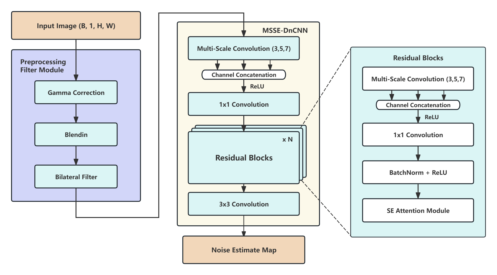
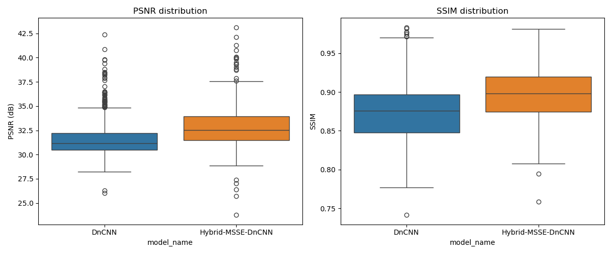
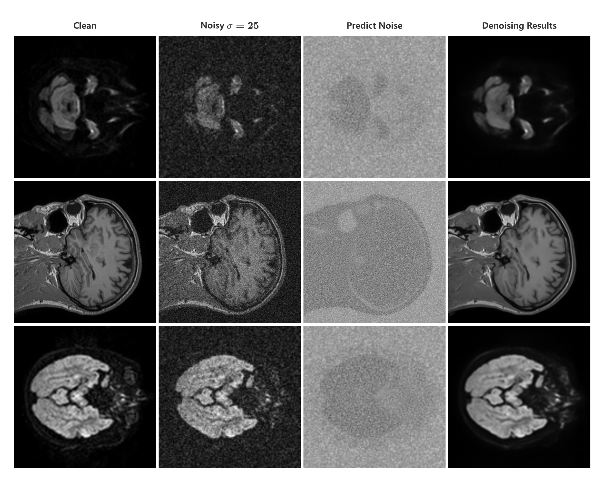
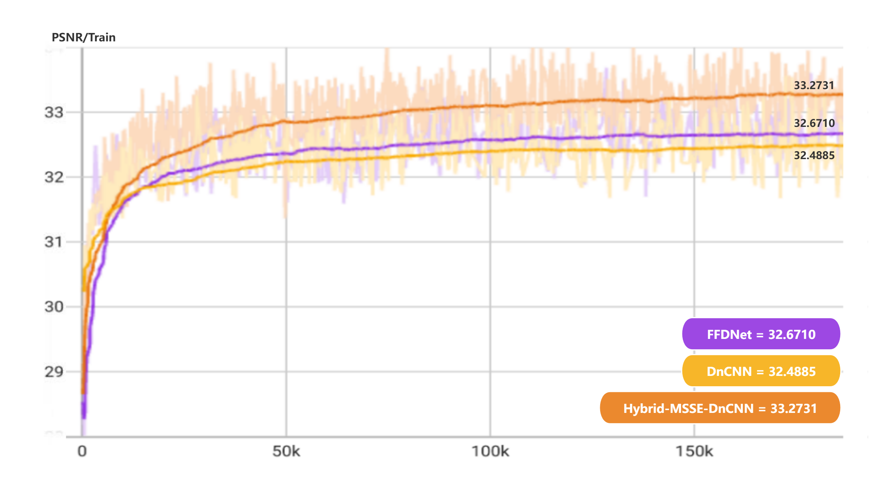

# Hybrid-MSSE-DnCNN Model
An improved version of DnCNN for MRI denoising

## Model Structure


<div align=center>

### **Comparison of DnCNN and Hybrid-MSSE-DnCNN**
| Feature            | DnCNN | Hybrid-MSSE-DnCNN |
|--------------------|-------|------------------|
| **Preprocessing (Gamma, Blending, Bilateral Filter)** | ❌ No  | ✅ Yes |
| **Multi-Scale Convolution** | ❌ No  | ✅ Yes (3,5,7 kernels) |
| **SE Attention Mechanism** | ❌ No  | ✅ Yes (Channel-wise attention) |
| **1x1 Convolution for Reduction** | ❌ No  | ✅ Yes (After multi-scale feature extraction) |
| **Batch Normalization** | ✅ Yes | ✅ Yes |
| **Residual Learning** | ✅ Yes | ✅ Yes |
</div>

## Results




## Training Process

<div align=center>
    
</div>

## Installation
```bash
conda env create -f environment.yml
```
## Data Preparation

1. Download [IXI-Dataset](https://brain-development.org/ixi-dataset/) (IXI-DTI, IXI-MRA, IXI-PD, IXI-T1, IXI-T2)
2. Save into `./data/` folder
3. Run the preprocess script
```bash
python ./preprocess.py
```
4. Create Noisy Data, set the *noise_level* to 15, 25, 50 to get different noise levels
```bash
python ./add_noise.py
```


## Training
```bash
python ./src/train.py
```

## Test
```bash
python ./src/test.py
```

## Significant Test
```bash
python ./src/batch_test.py
python ./src/significance.py
```
